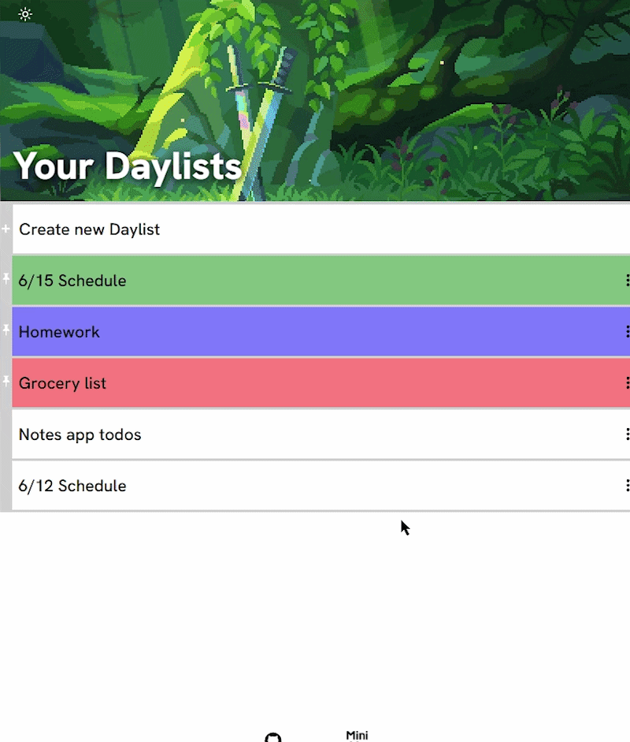

# Daylist
A web app for organizing your day with lists, tasks, and notes.

### [Try the live demo](https://jonny-berry.github.io/daylist/)

## Features
- Create and manage lists
- Add tasks to lists and cycle through their status
- Attach notes to any list
- Pin lists to stay organized
- Light and dark modes

**Built with:** HTML, CSS, JavaScript, Webpack, npm

---

[GitHub](https://github.com/jonny-berry) · [Twitter](https://x.com/jonnyDevvs) · [YouTube](https://www.youtube.com/@JonnyDevvs) · [Email](mailto:jonnydevvs@gmail.com)
